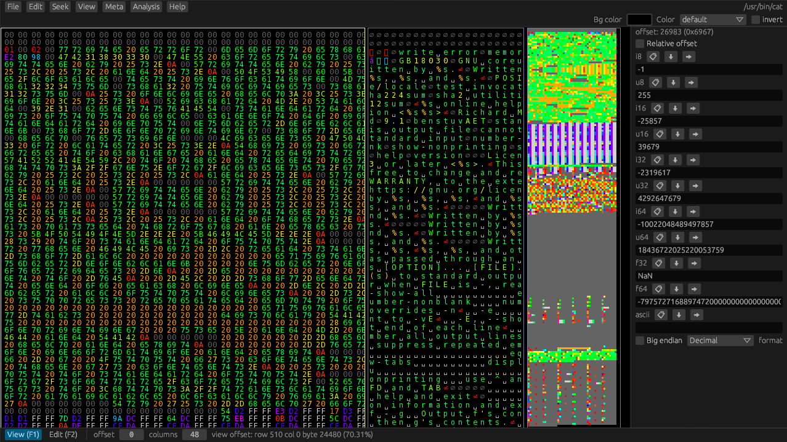

# Hexerator
Versatile GUI hex editor focused on binary file exploration and aiding pattern recognition. Written in Rust.

Check out [features.md](features.md) for a detailed list of features!

## Screenshot

## Supported platforms

- Windows 7 or newer
- Linux

Looking for an Mac OS developer/maintainer!

## Dependencies

- [SFML](https://www.sfml-dev.org/) installed on your system.

  See https://github.com/jeremyletang/rust-sfml#environment-variables if SFML isn't in your
  include/library search paths.

- A C++ compiler for building some native dependencies

## Rust version
Hexerator only supports latest nightly Rust. You need an up-to-date nightly to build Hexerator.
As Hexerator matures, it will slowly transition to stable Rust.
The plan is for Hexerator 1.0 to be buildable with a stable Rust version.

## Hardware requirements

- A 32 bit or 64 bit CPU.
  64 bit is highly recommended, because 32 bit can only open files up to 4 GB large.
  Additionally, 32 bit support is not being tested right now.

- A fairly strong GPU that supports OpenGL 2.1+.
  Hexerator renders using the GPU, and it can render a lot of stuff on the screen at once,
  making it fairly GPU intensive.
