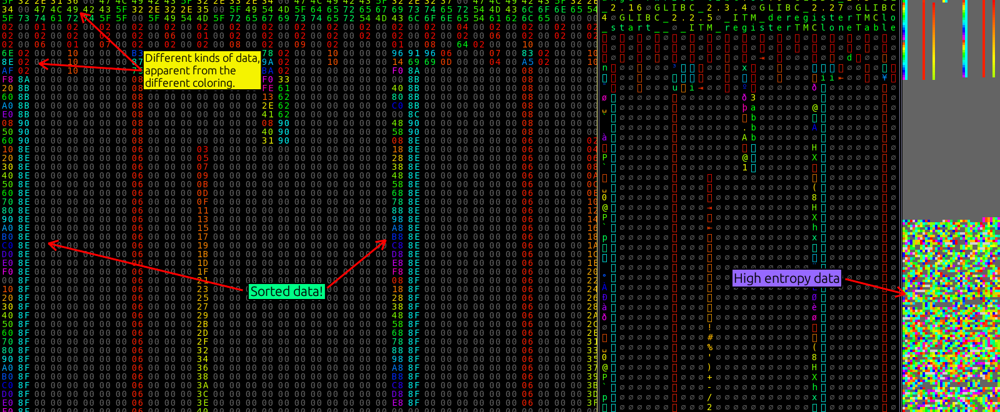
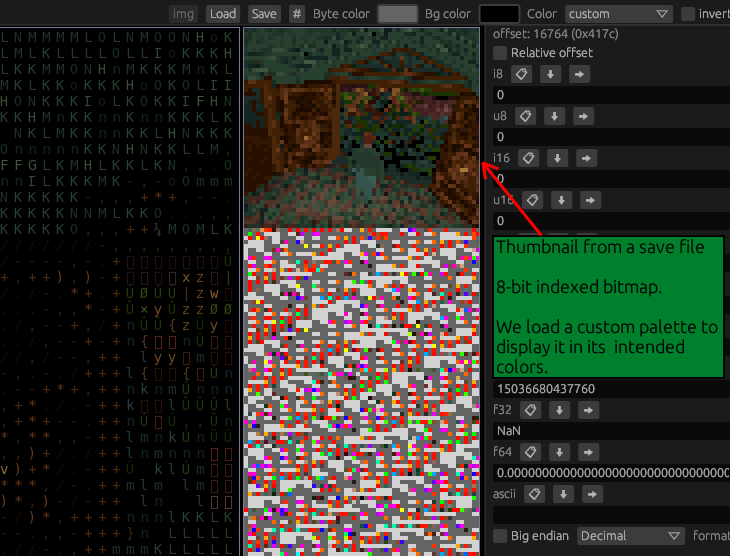
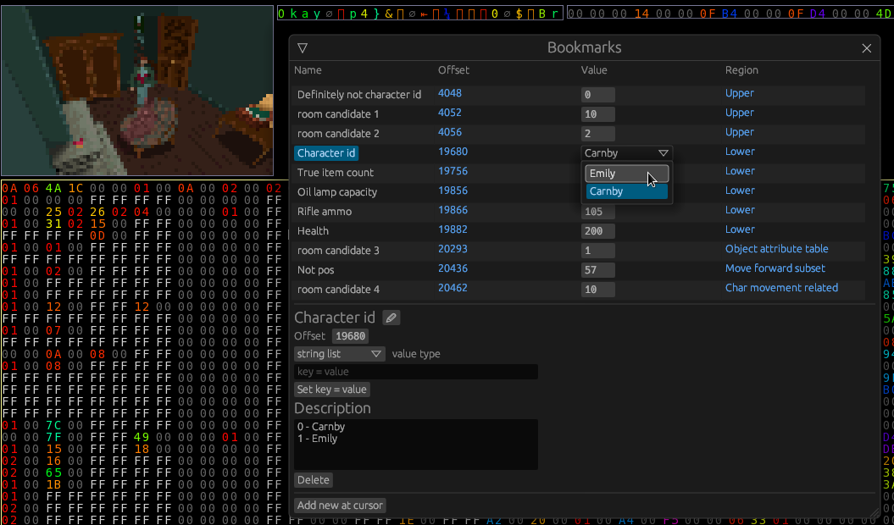

Legend:
- [ ] = Unimplemented
- [x] = Implemented

# Features
- [x] [Colorized values](#colorized-values)
  - [x] [Custom color palettes](#custom-color-palettes)
- [x] [Easy data alignment](#easy-data-alignment)
- [x] [Built-in process memory editing](#process-memory-editing)
- [x] [Multiple source types](#multiple-source-types) (file/streamed sources)
- [x] [Rich command line options](commandline.md)
- [x] [Bookmarks](#bookmarks)
- [x] [Multiple configurable views](#multiple-configurable-views)
- [x] Lua scripting support for various operations, like fill.
- [x] Diffing functionality
- [ ] [Huge file support through memory mapped files](#huge-file-support-through-memory-mapped-files)

# Non-features
- [Insertion](#insertion)
- [Memory holes support, generic support for huge data](#memory-holes-support-generic-support-for-huge-data)

# Features

## Colorized values
Colorizing values helps a lot with human pattern recognition.

### Custom color palettes

Custom color palettes can be saved and loaded, and generated through various means.

## Easy data alignment
Hexerator considers it important to easily align data with shortcut keys. Proper alignment can make a lot of difference
with pattern recognition.

You can see a YouTube video of it in action here:

## Process Memory editing
Built-in support for opening memory of a process and viewing/editing it.
Can be used to cheat in games, or discover how different applications store data in memory.

You can see a YouTube video of it in action here:

You need to run hexerator with root/admin privileges to open memory of other processes.

## Multiple source types
Hexerator supports opening both files and streamed sources like standard input or character devices like `/dev/urandom`.

## Bookmarks

Quickly and easily save and access points of interest in the data.

Additional support for setting a type for a bookmark to display and manipulate the data
associated with it.

## Multiple configurable views

You can have different views into different regions of the same file, with
different column counts and other configurable properties.

## Huge file support through memory mapped files

Huge files that couldn't fit in memory can be opened as memory mapped files through a command line
option.
To be implemented.

# Non-features

## Insertion
Insertion would complicate implementation, and for most binary data, including process memory, it will just mess up the data.

## Memory holes support, generic support for huge data
Originally, I wanted to have a generic mechanism for loading only parts of files, but I found that
it would make the implementation way more complex, and possibly inefficient, so I dropped the idea.
Huge files will be eventually supported through memory mapped file support.